<picture>
  <source media="(prefers-color-scheme: dark)" srcset="assets/sky-dark.svg">
  <source media="(prefers-color-scheme: light)" srcset="assets/sky-light.svg">
  
</picture>

### hey, I'm Bohdan

Python developer from Lviv. Six years ago I pushed my first Django commit,
and I still get the same small kick when something I built just quietly works.

These days it's mostly FastAPI and Django backends, React when the frontend
needs a hand, and a lot of fiddling with LLMs to make them actually useful.
My favorite kind of system is the one that lets everyone sleep through the night.

**what's in the sky tonight**

Python, FastAPI, Django, PostgreSQL, Redis, Celery, React, Next.js, TypeScript,
AWS, Terraform, Docker, and a growing cluster of OpenAI and Claude API calls.

**things I'm quietly proud of**

a system that takes 500K+ requests a day without drama,
two engineers I mentored who are now doing senior work,
and very few 3 AM alerts.

**off the clock**

night walks around Lviv, good tea, and way too many playlists for focus.

say hi: [linkedin](https://linkedin.com/in/drahanbohdan) · [bohdandrahann@gmail.com](mailto:bohdandrahann@gmail.com)
